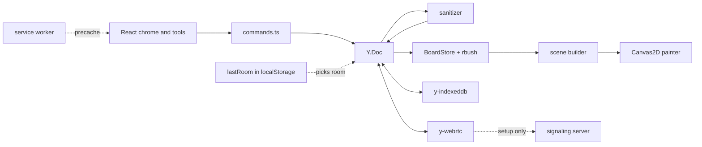

# 🖍️ Whiteboard

> Local-first whiteboard. Yjs CRDT, IndexedDB and WebRTC; edits made offline merge on reconnect.

**3.2 ms p95 paint per frame panning 10,000 shapes (Ryzen 9 7900X, Chromium 153), offline-first, and no server ever holds your data.**

<!-- readme-header -->
[](https://github.com/sathwikbairaboina2/whiteboard/actions/workflows/ci.yml)    

| Measured | Source |
|---|---|
| **3.2 ms p95 paint, 10k shapes** | `bench/results.json` |


A local-first whiteboard. Shapes live in a Yjs CRDT, persist to IndexedDB, and sync peer to peer over WebRTC. The only server is a small signaling relay that introduces peers and never sees board content. The app is an installable PWA and keeps working offline.

## What it does

- Draw rectangles, ellipses and freehand strokes; select, move, delete, undo and redo. Pan with space-drag, middle-drag or the wheel; zoom with Ctrl/Cmd + wheel.
- Saves every board to IndexedDB on the device. A reload works offline, and opening `/` again returns to the last board.
- Syncs peers directly over WebRTC (`y-webrtc`). Edits made while peers are disconnected merge when they reconnect.
- Shares a board by URL: the room id and key live in the `#room=...&key=...` fragment, which browsers never send to a server.
- Treats remote and stored data as untrusted: a sanitizer repairs out-of-limit values the same way on every peer, so honest peers still converge.
- Installs as a PWA (service worker precache via `vite-plugin-pwa`).

## Quickstart

Needs Node 24+ and pnpm 9.

```bash
pnpm install
pnpm signaling   # terminal 1: signaling relay on ws://localhost:5411
pnpm dev         # terminal 2: app on http://localhost:5410/
```

1. Open `http://localhost:5410/`. The URL gains `#room=...&key=...`.
2. Draw with R (rectangle), O (ellipse) or P (freehand). V selects, Delete removes, Ctrl+Z undoes, Ctrl+Y or Ctrl+Shift+Z redoes.
3. Open the full URL in a second browser profile. The two boards sync.

Add `?debug=1` for shape, drawn and paint-time counters.

Shipping images (nginx for the app, Node for signaling):

```bash
docker compose up -d --build   # app on http://localhost:5413/, signaling on ws://localhost:5414
docker compose down
```

## Configuration

| Setting | Where | Default |
|---|---|---|
| `VITE_SIGNALING_URLS` | Build-time env, comma-separated `ws://` or `wss://` URLs | `ws://localhost:5411` (Docker build: `ws://localhost:5414`) |
| `PORT` | Signaling server env | `5411` |
| `?signaling=<ws url>` | Query string, overrides the build-time list | none |
| `?ice=none` | Query string, disables STUN (used by e2e) | WebRTC library defaults |
| `?debug=1` | Query string, debug overlay and test hook | off |

## Architecture



- Command layer: every local write goes through `src/doc/commands.ts`, which validates, clamps and writes in one transaction. A lint test fails if anything else calls `transact`.
- Sanitizer: `src/doc/sanitize.ts` clamps coordinates, sizes, stroke widths and point arrays deterministically. Shapes that are structurally invalid are skipped by the renderer.
- CRDT: one `Y.Doc` per tab, a map of shapes plus an order array. Undo uses a `Y.UndoManager` that tracks only local commands, so it never reverts another peer's edit.
- Rendering: Canvas2D, with an rbush index so only shapes in the viewport are drawn. No dirty rects (ADR 0004).
- Signaling: `server/signaling.ts` relays connection setup only, with a 64 KB message cap and at most 100 topics per connection.
- Room choice on start (`src/main.tsx`): the URL fragment, then the last room on this device, then a new room.

## Measured

All numbers come from `bench/results.json`, written by `pnpm bench`. Machine: AMD Ryzen 9 7900X 12-Core Processor, 24 cores, win32 10.0.26200, Node v24.18.0, Chromium 153.0.8010.12. Run on 2026-10-03T23:22:38Z. The machine was shared with other jobs, so numbers move between runs (earlier runs of the same benchmark gave a pan10k paint p95 between 1.5 and 5.3 ms; see the ledger).

| Metric | Value |
|---|---|
| Pan, 10,000 shapes, paint p50 / p95 | 1.8 ms / 3.2 ms |
| Pan, 10,000 shapes, frame interval p50 / p95 | 16.7 ms / 16.7 ms |
| Whole board in view (zoom 0.16), paint p50 / p95 | 8.1 ms / 13.6 ms |
| Whole board in view, frame interval p50 / p95 | 33.3 ms / 33.4 ms |
| Peer latency, 50 edits across two browser contexts, p50 / p95 | 2.9 ms / 29.3 ms |
| Update size, move one shape | 43 bytes |
| Update size, add one rectangle | 278 bytes |
| Encoded document, 10,000 shapes | 4,809,549 bytes |
| Convergence, 3 peers x 1,000 random commands, shuffled delivery | converged (true) |

The convergence run takes about 38 s of harness time, not shown as a result: the harness delivers fewer updates per round than the peers produce, so roughly 1,500 out-of-order updates queue up and Yjs pending-struct merging dominates. That time is not app latency, and it varied from 10 s to 73 s across runs of the same code.

Paint time covers JavaScript and Canvas2D command submission, not GPU raster (ADR 0004). With the whole 10,000-shape board in view the paint p95 is 13.6 ms on this run, under the 16.7 ms budget but with little headroom (an earlier run on a busier machine measured 21.7 ms), so zoomed-out views of very large boards are the known weak spot.

## Project layout

| Path | Contents |
|---|---|
| `src/doc/` | Board roots, zod schema and limits, commands, sanitizer |
| `src/history/` | Local-only undo |
| `src/crdt-core/` | Room links, IndexedDB persistence, WebRTC wrapper (imports nothing else from `src`) |
| `src/render/` | Camera, geometry, rbush index, scene builder, painter, frame loop |
| `src/tools/` | Select, rectangle, ellipse, freehand |
| `src/app/`, `src/ui/` | URL config, session, canvas controller; React top bar, toolbar, debug overlay |
| `server/signaling.ts` | Stateless signaling relay |
| `bench/`, `src/bench/` | Node and browser benchmarks, `results.json` |
| `tests/`, `e2e/` | Vitest unit and property tests; Playwright tests |

Developer guide: [docs/DEVDOCS.md](docs/DEVDOCS.md).

## What I gave up

See the decision records: [0001 y-webrtc, not y-websocket](docs/adr/0001-y-webrtc-over-y-websocket.md), [0002 document layout](docs/adr/0002-document-layout.md), [0003 command layer and sanitizer](docs/adr/0003-command-layer-and-sanitizer.md), [0004 culling, no dirty rects](docs/adr/0004-canvas-culling-no-dirty-rects.md), [0005 room secret in the fragment](docs/adr/0005-room-secret-in-fragment.md), [0006 deterministic tests](docs/adr/0006-deterministic-tests.md), [0007 host Node and Docker](docs/adr/0007-ports-docker-and-host-node.md), [0008 installable means PWA](docs/adr/0008-installable-means-pwa.md).

## Tests

- `pnpm test`: 19 files, 60 tests passed, 0 skipped. Includes `commands.property` and `convergence.property` with fixed seed 42.
- `pnpm e2e`: 7 tests passed, run against a production build on :5412 and a signaling server on :5415 (draw, undo and delete, PWA installability, two-context WebRTC sync, offline reload, edits made while disconnected merging after reconnect, reopening `/` returns to the last board).

## Status

v0.1, local prototype. Not built yet: text, arrow and eraser tools, live cursors, export and import, resize and rotate handles, TURN or another relay (peers must be online at the same time and reachable directly), a public deploy, and a room picker beyond the last board. Peer latency was measured over loopback only. The bundle is a single chunk over 500 kB.

## License

MIT. `server/signaling.ts` is based on the signaling server in [y-webrtc](https://github.com/yjs/y-webrtc) (MIT, Kevin Jahns).
