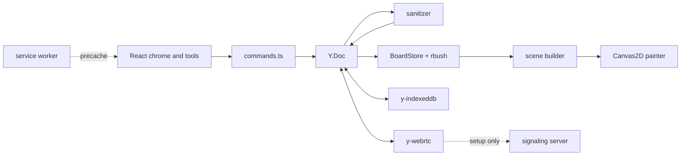

# Whiteboard developer guide

## 1. What it is

An offline-first whiteboard. Shapes live in a Yjs CRDT. They sync peer to peer over WebRTC and persist to IndexedDB. No server holds your data.

Headline number, measured by `pnpm bench` into `bench/results.json`: **5.3 ms p95 paint per frame panning 10,000 shapes** (Chromium 153.0.8010.12, AMD Ryzen 9 7900X, shared machine, 2026-10-03). Paint time is JavaScript plus Canvas2D submission, not GPU raster.

## 2. Quickstart (5 minutes)

```bash
pnpm install
pnpm signaling        # terminal 1: signaling relay on ws://localhost:5411
pnpm dev              # terminal 2: app on http://localhost:5410/
```

1. Open `http://localhost:5410/`. The URL gains `#room=...&key=...`.
2. Draw with R (rectangle), O (ellipse), P (freehand). V selects.
3. Copy the full URL into a second browser profile. Both boards now sync.

Add `?debug=1` to see shape, drawn and paint-time counters.

## 3. Architecture



Local writes go through `commands.ts` only. Remote and stored data pass through the sanitizer. The renderer reads a validated cache and draws only the shapes the viewport can see.

## 4. Project layout

| Path | What lives there |
|---|---|
| `src/doc/` | Board roots, zod schema and limits, commands, sanitizer |
| `src/history/` | Undo scoped to local commands |
| `src/crdt-core/` | Room links, IndexedDB persistence, WebRTC wrapper (imports nothing from the rest of `src`) |
| `src/render/` | Camera, geometry, rbush index, scene builder, painter, store, frame scheduler |
| `src/tools/` | Select, rectangle, ellipse, freehand |
| `src/app/` | URL config, session, canvas controller |
| `src/ui/` | React top bar, toolbar, debug overlay, tokens |
| `src/bench/`, `bench/` | Synthetic data, browser and node benchmarks, report |
| `server/signaling.ts` | Stateless y-webrtc signaling relay |
| `tests/`, `e2e/` | Vitest unit and property tests, Playwright tests |
| `deploy/`, `Dockerfile`, `docker-compose.yml` | Shipping images |
| `docs/adr/` | Decision records |

## 5. Run, test, benchmark

| Command | What it does | Port |
|---|---|---|
| `pnpm dev` | Vite dev server | 5410 |
| `pnpm signaling` | Signaling relay (dev) | 5411 |
| `pnpm preview` | Preview of the production build | 5412 |
| `docker compose up -d --build` | App image and signaling image | 5413, 5414 |
| `pnpm e2e` | Playwright tests with their own signaling server | 5412, 5415 |
| `pnpm bench` | Node and browser benchmarks, writes `bench/results.json` | 5412, 5415 |
| `pnpm test` | Vitest, 18 files, 56 tests | none |
| `pnpm typecheck` | TypeScript 7 | none |
| `pnpm build` | Typecheck plus Vite build (writes `dist/sw.js`) | none |
| `pnpm demo` | Records two boards and builds `docs/media/demo.gif` via Docker ffmpeg | 5412, 5415 |

## 6. Key decisions and what they gave up

- [0001 y-webrtc with self-hosted signaling](adr/0001-y-webrtc-over-y-websocket.md): no server stores data, but peers must be online together or share a device to sync, and there is no TURN relay.
- [0002 nested map per shape, plain point arrays](adr/0002-document-layout.md): small updates for moves, but a stroke is edited as a whole value.
- [0003 command layer plus sanitizer](adr/0003-command-layer-and-sanitizer.md): hostile data cannot break the renderer, at the cost of every write going through one gate.
- [0004 rbush culling, no dirty rects](adr/0004-canvas-culling-no-dirty-rects.md): simple painting, but zoomed-out views of huge boards are the slowest case.
- [0005 room key in the URL fragment](adr/0005-room-secret-in-fragment.md): the key never reaches a server, but anyone with the link has access.
- [0006 fixed seeds and STUN-free e2e](adr/0006-deterministic-tests.md): reproducible runs, but real-network NAT traversal is not tested.
- [0007 host Node for dev, Docker for shipping](adr/0007-ports-docker-and-host-node.md).
- [0008 installable means PWA plus Docker images](adr/0008-installable-means-pwa.md): no npm package for `crdt-core` yet.

## 7. Known limits and what's left

- Not built: text, arrow and eraser tools, awareness cursors, `.wbjson` export and import, PNG export, dirty-rect painting, resize and rotate handles, an npm package for `crdt-core`, TURN or a relay, a public deploy.
- Whole-board view of 10,000 shapes measured a paint p95 of 21.7 ms on the final bench run, above the 16.7 ms budget. Earlier runs of the pan benchmark were much lower, so the shared machine adds noise. Worth a lower-level look (batching by style, level of detail when zoomed out).
- Peer latency is measured on one machine over loopback, so it says nothing about real networks.
- The bundle is one large chunk (over 500 kB). Splitting it is untried.
- The service worker uses `autoUpdate`, so a new deploy applies on the next load without a prompt.
