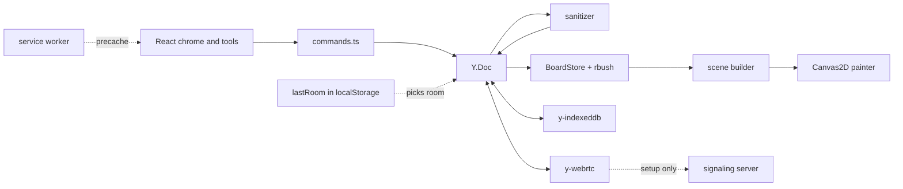

# Whiteboard developer guide

## 1. What it is

An offline-first whiteboard that runs in the browser. Shapes live in a Yjs CRDT. They save to IndexedDB on your device and sync peer to peer over WebRTC. A small signaling server introduces peers. It never stores or sees board content.

The app installs as a PWA. Opening it again returns to your last board. Edits made while peers are disconnected merge when they reconnect.

**Headline number: 3.2 ms p95 paint per frame while panning a 10,000-shape board.** `pnpm bench` measured it and wrote it to `bench/results.json` (Chromium 153.0.8010.12, AMD Ryzen 9 7900X, shared machine, 2026-10-03). Paint time is JavaScript plus Canvas2D command submission. It does not include GPU raster.

## 2. Quickstart (5 minutes)

You need Node 24 or newer and pnpm 9.

```bash
pnpm install
pnpm signaling        # terminal 1: signaling relay on ws://localhost:5411
pnpm dev              # terminal 2: app on http://localhost:5410/
```

1. Open `http://localhost:5410/`. The URL gains `#room=...&key=...`.
2. Draw with R (rectangle), O (ellipse) or P (freehand). V selects. Delete removes. Ctrl+Z undoes.
3. Copy the full URL into a second browser profile. The two boards now sync.
4. Open `http://localhost:5410/` again with no fragment. You land on the same board.

Add `?debug=1` to see shape, drawn and paint-time counters.

To run the shipping images instead: `docker compose up -d --build`. The app is on `http://localhost:5413/` and signaling is on port 5414. Stop them with `docker compose down`.

## 3. Architecture



- Local writes go through `src/doc/commands.ts` only. A lint test fails if other code calls `transact`.
- Remote and stored data pass through the sanitizer. Bad data is repaired the same way on every peer, so peers still converge.
- The renderer reads a validated cache. It draws only the shapes the viewport can see, found with an rbush index.
- On start, `src/main.tsx` picks the room in this order: the URL fragment, then the last room on this device, then a new room.

## 4. Project layout

| Path | What lives there |
|---|---|
| `src/doc/` | Board roots, zod schema and limits, commands, sanitizer |
| `src/history/` | Undo that reverts only this peer's commands |
| `src/crdt-core/` | Room links, IndexedDB persistence, WebRTC wrapper with connect and disconnect. Imports nothing from the rest of `src` |
| `src/render/` | Camera, geometry, rbush index, scene builder, painter, store, frame loop |
| `src/tools/` | Select, rectangle, ellipse, freehand |
| `src/app/` | URL config, session, canvas controller, last-room memory (`lastRoom.ts`) |
| `src/ui/` | React top bar, toolbar, debug overlay, design tokens |
| `src/bench/`, `bench/` | Synthetic data, browser and Node benchmarks, report, `results.json` |
| `server/signaling.ts` | Stateless y-webrtc signaling relay |
| `tests/` | Vitest unit and property tests |
| `e2e/` | Playwright tests and the demo recording |
| `deploy/`, `Dockerfile`, `docker-compose.yml` | nginx config and the shipping images |
| `scripts/demo-gif.ts` | Turns the demo video into `docs/media/demo.gif` |
| `docs/adr/` | Decision records |

## 5. Run, test, benchmark

| Command | What it does | Port |
|---|---|---|
| `pnpm dev` | Vite dev server | 5410 |
| `pnpm signaling` | Signaling relay for dev | 5411 |
| `pnpm preview` | Serves the production build | 5412 |
| `docker compose up -d --build` | App image and signaling image | 5413, 5414 |
| `pnpm typecheck` | TypeScript 7, no emit | none |
| `pnpm test` | Vitest: 19 files, 60 tests | none |
| `pnpm build` | Typecheck plus Vite build (writes `dist/sw.js`) | none |
| `pnpm e2e` | Playwright: 7 tests, with their own build and signaling server | 5412, 5415 |
| `pnpm bench` | Node and browser benchmarks. Writes `bench/results.json` | 5412, 5415 |
| `pnpm demo` | Records two boards and builds `docs/media/demo.gif` with Docker ffmpeg | 5412, 5415 |

The e2e tests cover drawing, undo and delete, PWA installability, live sync between two browser contexts, an offline reload, offline edits merging after reconnect (`e2e/merge.spec.ts`), and reopening `/` (`e2e/lastroom.spec.ts`).

Playwright's `setOffline` does not block loopback WebRTC. So the merge test and the demo cut the connection with a test hook. With `?debug=1` or `?hook=1`, the page exposes `window.__session.disconnect()` and `reconnect()`.

## 6. Key decisions and what they gave up

- [0001 y-webrtc with self-hosted signaling](adr/0001-y-webrtc-over-y-websocket.md): no server stores data. But peers must be online at the same time to sync, and there is no TURN relay.
- [0002 nested map per shape, plain point arrays](adr/0002-document-layout.md): moves send small updates. A stroke is edited as one whole value.
- [0003 command layer plus sanitizer](adr/0003-command-layer-and-sanitizer.md): hostile data cannot break the renderer. Every write must go through one gate.
- [0004 rbush culling, no dirty rects](adr/0004-canvas-culling-no-dirty-rects.md): painting stays simple. Zoomed-out views of huge boards are the slowest case.
- [0005 room key in the URL fragment](adr/0005-room-secret-in-fragment.md): the key never reaches a server. Anyone with the link has full access. The last room's key is also kept in `localStorage` on the device.
- [0006 fixed seeds and STUN-free e2e](adr/0006-deterministic-tests.md): runs are reproducible. Real-network NAT traversal is not tested.
- [0007 host Node for dev, Docker for shipping](adr/0007-ports-docker-and-host-node.md): fast dev loop. Dev and shipping use different runtimes.
- [0008 installable means PWA plus Docker images](adr/0008-installable-means-pwa.md): no npm package for `crdt-core` yet.

## 7. Known limits and what's left

- Not built yet: text, arrow and eraser tools, live cursors, `.wbjson` export and import, PNG export, dirty-rect painting, resize and rotate handles, an npm package for `crdt-core`, TURN or a relay, a public deploy, and a room picker for more than the last board.
- With all 10,000 shapes in view (zoom 0.16), paint p95 was 13.6 ms on the final run. That is under the 16.7 ms frame budget with little room to spare. A busier run measured 21.7 ms. Batching by style or a simpler level of detail when zoomed out could help.
- The machine was shared during benchmarks, so numbers move between runs. Pan p95 ranged from 1.5 to 5.3 ms across runs.
- Peer latency (p50 2.9 ms, p95 29.3 ms) is measured over loopback on one machine. It says nothing about real networks.
- The 3-peer convergence property run takes about 38 s of harness time. That is test-harness queueing, not app latency.
- The bundle is one chunk over 500 kB. Splitting it has not been tried.
- The service worker uses `autoUpdate`. A new deploy applies on the next load with no prompt.
- The `?hook=1` test hook works in production builds too. It can only disconnect or reconnect your own tab.
